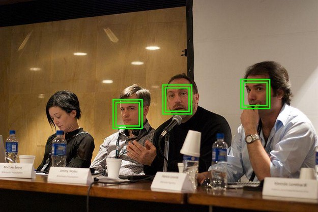

# Common Concepts Related To SSD Algorithms and CV in General
- ### Bounding Boxes

- ### Intersect Over Union: Jaccard's Distance

 

# Applications
- ### Autonomous Vehicles  

- ### Mass Surveliance  

- ### Food Classificaiton  

- ### People/Face Detection  

___

# Refernces
- [SSD: Single Shot MultiBox Detector](https://arxiv.org/abs/1512.02325) by Wei Liu, Dragomir Anguelov, Dumitru Erhan, Christian Szegedy, Scott Reed, Cheng-Yang Fu, Alexander C. Berg

- [YOLOv3: An Incremental Improvement](https://arxiv.org/abs/1804.02767) by Joseph Redmon, Ali Farhadi

- [Understanding SSD MultiBox](https://towardsdatascience.com/understanding-ssd-multibox-real-time-object-detection-in-deep-learning-495ef744fab) — Real-Time Object Detection In Deep Learning - TWDS Blog by Eddie Forson

- [How Single Shot MultiBox Detector ](https://sobhan-shukueian.medium.com/how-single-shot-multibox-detector-ssd-real-time-object-detection-technique-works-47e87bee2562) Real-Time Object Detection Technique works?

- [SSD + Architecture of SSD](https://iq.opengenus.org/single-shot-detector/) - opengenus.org
